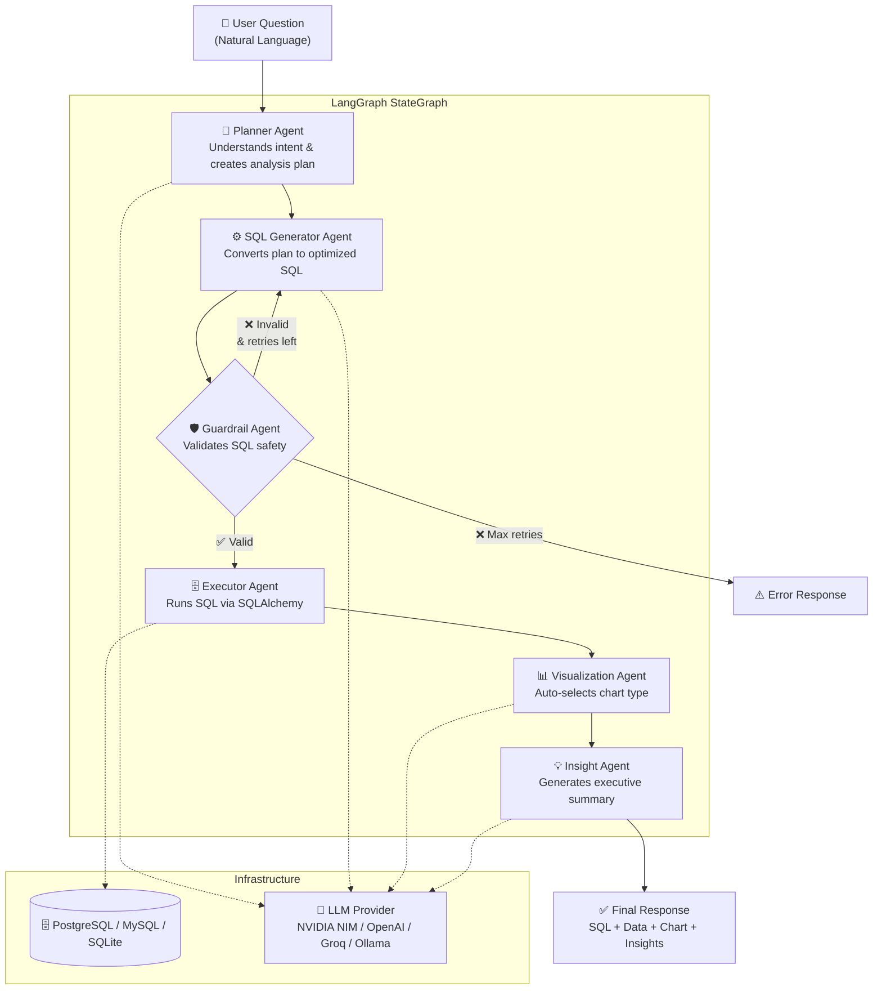
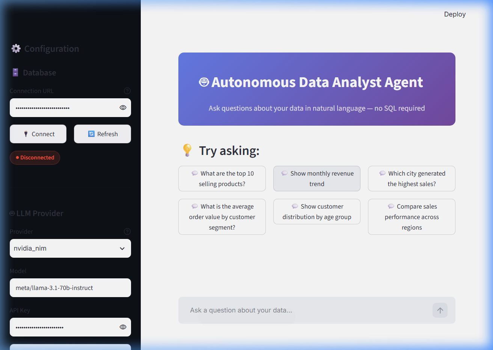

<div align="center">

# 🤖 Autonomous Data Analyst Agent

[](https://python.org)
[](https://langchain-ai.github.io/langgraph/)
[](https://postgresql.org)
[](https://streamlit.io)
[](https://docker.com)
[](LICENSE)

**An AI-powered autonomous data analyst that lets you ask questions in natural language — no SQL required.**

*Built with LangGraph multi-agent architecture, supporting NVIDIA NIM, OpenAI, Groq, and Ollama.*

---

[Features](#-features) •
[Architecture](#-architecture) •
[Quick Start](#-quick-start) •
[Docker Setup](#-docker-setup) •
[Example Questions](#-example-questions) •
[Tech Stack](#-tech-stack)

</div>

---

## ✨ Features

- 🧠 **Natural Language Querying** — Ask questions in plain English, get SQL + results + charts + insights
- 🤖 **6-Agent LangGraph Pipeline** — Planner → SQL Generator → Guardrail → Executor → Visualizer → Insight
- 🛡️ **SQL Safety Guardrails** — Blocks all destructive operations, injection attempts, and non-SELECT queries
- 📊 **Auto-Visualization** — Automatically selects the best chart type (bar, line, pie, scatter, histogram, heatmap, table)
- 💡 **Executive Insights** — AI-generated analysis with key findings, business implications, and recommendations
- 🔄 **Multi-LLM Support** — NVIDIA NIM, OpenAI, Groq, Ollama — switch providers at runtime
- 🗄️ **Multi-Database** — PostgreSQL, MySQL, SQLite — auto-detects schema via SQLAlchemy reflection
- 📁 **CSV Upload** — Upload CSVs for ad-hoc analysis without database changes
- 📥 **Export Everything** — Download results as CSV, charts as PNG, queries as SQL
- 🎨 **Premium Dark UI** — Modern Streamlit dashboard with chat interface
- 🐳 **Docker Ready** — One-command deployment with Docker Compose
- ♻️ **Auto-Retry** — Automatically retries SQL generation on validation failures

---

## 🏗️ Architecture



---

## 📸 Screenshots

### Streamlit Dashboard UI


---

## 🚀 Quick Start

### Prerequisites

- Python 3.12+
- PostgreSQL 14+ (or use Docker)
- An LLM API key (NVIDIA NIM, OpenAI, or Groq) — or Ollama for local models

### 1. Clone & Install

```bash
git clone https://github.com/yourusername/autonomous-data-analyst-agent.git
cd autonomous-data-analyst-agent

# Create virtual environment
python -m venv venv
source venv/bin/activate  # Windows: venv\Scripts\activate

# Install dependencies
pip install -r requirements.txt
```

### 2. Configure Environment

```bash
cp .env.example .env
# Edit .env with your database URL and LLM API key
```

### 3. Seed Sample Data

```bash
python -m database.sample_data
```

This creates 7 tables with **100k+ realistic records** (customers, orders, products, employees, sales, regions, categories).

### 4. Launch the App

```bash
streamlit run app.py
```

Open **http://localhost:8501** and start asking questions!

---

## 🐳 Docker Setup

The easiest way to get started — no local PostgreSQL needed:

```bash
# Copy and configure environment
cp .env.example .env
# Edit .env with your LLM API key

# Launch everything
docker compose up --build

# The app will be available at http://localhost:8501
# PostgreSQL runs on port 5432
# Sample data is automatically seeded
```

### Services

| Service | Description | Port |
|---------|-------------|------|
| `app` | Streamlit Dashboard | 8501 |
| `db` | PostgreSQL 16 | 5432 |
| `db-seed` | One-shot data seeder | — |

---

## 💬 Example Questions

| Question | What it does |
|----------|-------------|
| *"What are the top 10 selling products?"* | Ranks products by total quantity sold |
| *"Show monthly revenue trend"* | Time-series line chart of revenue |
| *"Which city generated the highest sales?"* | Geographic ranking with bar chart |
| *"What is the average order value by customer segment?"* | Segment comparison analysis |
| *"Show customer distribution by age group"* | Histogram / distribution chart |
| *"Compare sales across regions"* | Multi-region performance comparison |
| *"What's the order cancellation rate by month?"* | Trend analysis with conditional aggregation |
| *"Which employees have the most sales?"* | Employee performance ranking |
| *"Show the most popular product categories"* | Category revenue breakdown |
| *"What's the profit margin by product?"* | Calculated metric analysis |

---

## 🛠️ Tech Stack

| Component | Technology |
|-----------|-----------|
| **Language** | Python 3.12 |
| **Agent Orchestration** | LangGraph + LangChain |
| **Database** | PostgreSQL (primary), MySQL, SQLite |
| **ORM / Reflection** | SQLAlchemy 2.0 |
| **Data Processing** | Pandas, NumPy |
| **Visualization** | Plotly |
| **Frontend** | Streamlit |
| **LLM Providers** | NVIDIA NIM, OpenAI, Groq, Ollama |
| **Data Generation** | Faker |
| **Containerization** | Docker, Docker Compose |
| **Testing** | pytest |
| **Configuration** | python-dotenv, pydantic-settings |

---

## 📁 Project Structure

```
autonomous-data-analyst-agent/
│
├── agents/                     # Multi-agent implementations
│   ├── state.py               # Shared AgentState TypedDict
│   ├── planner.py             # 🧠 Planner Agent
│   ├── sql_generator.py       # ⚙️ SQL Generator Agent
│   ├── guardrail.py           # 🛡️ SQL Guardrail Agent
│   ├── executor.py            # 🗄️ SQL Executor Agent
│   ├── visualization.py       # 📊 Visualization Agent
│   └── insights.py            # 💡 Insight Agent
│
├── database/                   # Database layer
│   ├── connection.py          # SQLAlchemy connection manager
│   ├── reflection.py          # Schema auto-discovery
│   ├── sample_data.py         # Faker data generator (100k+ rows)
│   └── csv_handler.py         # CSV upload handler
│
├── graphs/                     # LangGraph orchestration
│   └── workflow.py            # StateGraph pipeline definition
│
├── prompts/                    # LLM prompt templates
│   ├── planner.txt            # Planner system prompt
│   ├── sql.txt                # SQL generator system prompt
│   ├── insight.txt            # Insight generator system prompt
│   ├── visualization.txt      # Chart recommender prompt
│   └── few_shot_examples.json # Few-shot SQL examples
│
├── utils/                      # Shared utilities
│   ├── llm_provider.py        # Multi-provider LLM factory
│   ├── cache.py               # Query result caching (LRU + TTL)
│   ├── token_tracker.py       # Token usage monitoring
│   ├── timer.py               # Execution timing
│   └── export.py              # CSV/PNG/SQL export
│
├── config/                     # Configuration
│   ├── settings.py            # Pydantic settings (from .env)
│   └── logging_config.py      # Structured logging
│
├── tests/                      # Test suite
│   ├── conftest.py            # Shared fixtures (MockLLM, test DB)
│   ├── test_guardrail.py      # 25+ guardrail validation tests
│   ├── test_planner.py        # Planner agent tests
│   ├── test_sql_generator.py  # SQL generator tests
│   ├── test_executor.py       # Executor agent tests
│   └── test_workflow.py       # Full pipeline integration tests
│
├── app.py                      # 🎨 Streamlit dashboard
├── requirements.txt            # Python dependencies
├── Dockerfile                  # Production Docker image
├── docker-compose.yml          # Full-stack deployment
├── .env.example                # Environment template
├── .gitignore                  # Git ignore rules
├── .dockerignore               # Docker build exclusions
├── LICENSE                     # MIT License
└── README.md                   # This file
```

---

## 🧪 Testing

```bash
# Run all tests
pytest tests/ -v

# Run with coverage
pytest tests/ -v --cov=agents --cov=database --cov=utils --cov-report=html

# Run specific test file
pytest tests/test_guardrail.py -v

# Run specific test
pytest tests/test_guardrail.py::TestGuardrailBlockedKeywords -v
```

---

## 🛡️ SQL Guardrail

The Guardrail Agent validates every query before execution. It **immediately rejects** queries containing:

| Category | Blocked Keywords |
|----------|-----------------|
| **DDL** | `CREATE`, `DROP`, `ALTER`, `TRUNCATE` |
| **DML** | `INSERT`, `UPDATE`, `DELETE`, `MERGE`, `UPSERT` |
| **Permissions** | `GRANT`, `REVOKE` |
| **System** | `COPY`, `VACUUM`, `EXEC`, `EXECUTE`, `CALL` |
| **Injection** | `SLEEP()`, `BENCHMARK()`, `LOAD_FILE()`, `INTO OUTFILE` |
| **Multi-Statement** | Semicolons, `UNION` + system tables |

**Only `SELECT` and `WITH` (CTE) queries are allowed.**

---

## 🔮 Future Improvements

- [ ] **Vector-based schema search** — Use embeddings for smarter table/column matching
- [ ] **Query explanation** — Natural language explanation of generated SQL
- [ ] **Scheduled reports** — Automated recurring analysis
- [ ] **Multi-user auth** — User authentication and role-based access
- [ ] **Query optimization advisor** — Suggest indexes and query improvements
- [ ] **Natural language data entry** — AI-assisted data input (with approval)
- [ ] **Dashboard builder** — Save and compose multiple visualizations
- [ ] **Slack/Teams integration** — Query from messaging platforms
- [ ] **Audit logging** — Track all queries and who ran them
- [ ] **Fine-tuned models** — Domain-specific SQL generation models

---

## 📝 Suggested Git Commits

```bash
git init
git add requirements.txt .env.example .gitignore LICENSE
git commit -m "chore: initialize project with dependencies and configuration"

git add config/
git commit -m "feat: add centralized settings and structured logging"

git add database/
git commit -m "feat: add database connection, schema reflection, and sample data generator"

git add utils/
git commit -m "feat: add LLM provider factory, caching, timing, and export utilities"

git add prompts/
git commit -m "feat: add prompt templates and few-shot SQL examples"

git add agents/
git commit -m "feat: implement all 6 agents (planner, sql_gen, guardrail, executor, viz, insight)"

git add graphs/
git commit -m "feat: add LangGraph workflow with conditional guardrail routing"

git add app.py
git commit -m "feat: add Streamlit dashboard with chat interface and dark theme"

git add Dockerfile docker-compose.yml .dockerignore
git commit -m "feat: add Docker and Docker Compose deployment configuration"

git add tests/
git commit -m "test: add comprehensive test suite for all agents and workflow"

git add README.md
git commit -m "docs: add detailed README with architecture diagram and setup guide"
```

---

## 🤝 Contributing

Contributions are welcome! Please:

1. Fork the repository
2. Create a feature branch (`git checkout -b feature/amazing-feature`)
3. Commit your changes (`git commit -m 'feat: add amazing feature'`)
4. Push to the branch (`git push origin feature/amazing-feature`)
5. Open a Pull Request

---

## 📄 License

This project is licensed under the MIT License — see the [LICENSE](LICENSE) file for details.

---

<div align="center">

**Built with ❤️ by an AI Engineering enthusiast**

*If this project helped you, give it a ⭐!*

</div>
